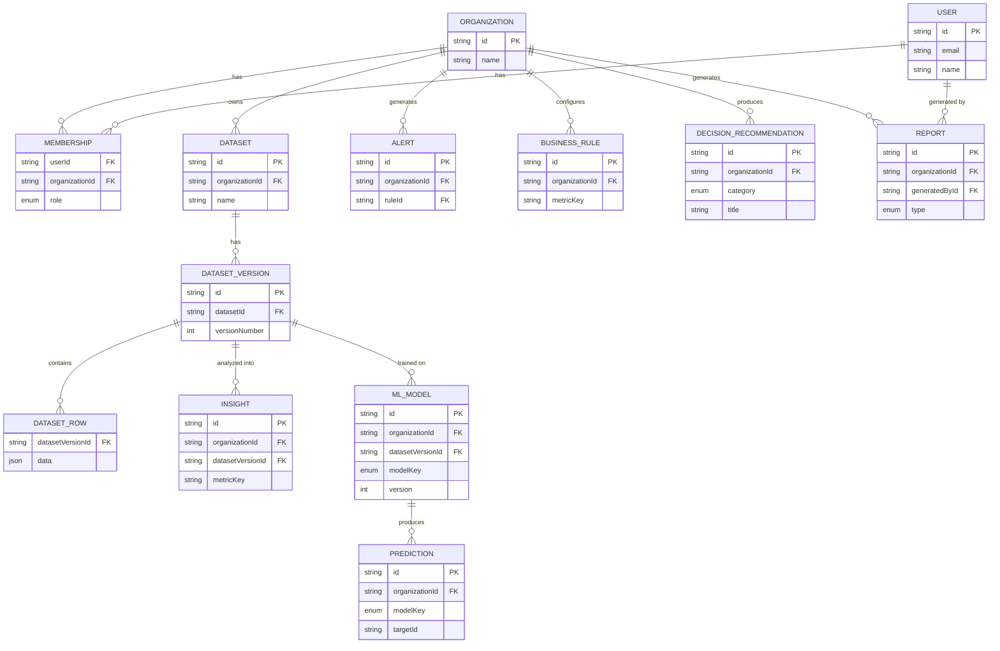

# StratIQ

[](https://github.com/saminadamn/stratiq/actions/workflows/ci.yml)


Enterprise Business Intelligence & Decision Intelligence Platform. See
[CHANGELOG.md](CHANGELOG.md) for what shipped in each phase.

> **Status:** v1.0. Multi-tenant auth/RBAC, dataset ETL, four analytics dashboards,
> an Analytics Intelligence Layer (trends/benchmarks/business rules/insights/alerts),
> Predictive Intelligence (churn/forecast/segmentation/recommendations), a deterministic
> Decision Intelligence Engine, executive PDF reporting, and production Docker/nginx
> deployment are all implemented. See [docs/ARCHITECTURE.md](docs/ARCHITECTURE.md) for
> the reasoning behind each decision.

## Stack

| Layer          | Choice                                                        |
| -------------- | --------------------------------------------------------------- |
| Frontend       | React + TypeScript + Tailwind CSS (Vite)                       |
| Backend        | Express + TypeScript (Clean Architecture)                      |
| ML service     | Python + FastAPI + scikit-learn (internal-only, called by the API) |
| Database       | PostgreSQL + Prisma ORM                                        |
| Auth           | JWT (access + refresh) with role-based access control          |
| Logging        | pino (structured JSON)                                         |
| Rate limiting  | express-rate-limit (global + stricter on login/signup)         |
| Dev env        | Docker Compose                                                 |
| Production     | Multi-stage Docker builds + nginx reverse proxy                |
| CI             | GitHub Actions (lint, typecheck, test, build)                  |

## Monorepo layout

```
StratIQ/
├── apps/
│   ├── api/          # Express API, Clean Architecture layers
│   ├── web/           # React dashboard (auth, datasets, analytics, predictions, reports)
│   └── ml-service/    # Python/FastAPI predictive models — internal-only, called by api
├── packages/
│   └── shared/        # Types/DTOs shared between api and web
├── docker/             # Dockerfiles, dev + prod compose, nginx config
├── docs/               # Architecture Decision Records
└── .github/workflows   # CI
```

## System Design


## API Internals


## Database Schema



Every table (except `User`) is scoped by `organizationId` — that's the
whole tenant-isolation model, enforced at the repository layer (every query
takes an `organizationId`) rather than relying on row-level security alone.

## Architecture Decisions

Full reasoning lives in [docs/ARCHITECTURE.md](docs/ARCHITECTURE.md); the
biggest single-topic decisions have their own ADRs:

| Decision | Why |
| --- | --- |
| [Clean Architecture layering](docs/adr/0001-clean-architecture.md) | Business logic testable without a database; ORM/framework swappable without touching use cases |
| [PostgreSQL, not a separate document store](docs/adr/0002-postgresql.md) | One database for both strictly-relational (auth/RBAC) and semi-structured (dataset rows, ML features) data via JSONB |
| [Prisma as the ORM](docs/adr/0003-prisma.md) | Compile-time-safe queries, generated migrations, isolated entirely inside `infrastructure/persistence/` |
| [FastAPI for the ML service](docs/adr/0004-fastapi-ml-service.md) | Pydantic validation + free OpenAPI docs; kept as its own internal-only process, not embedded in the Node API |
| [No LLMs in Decision Intelligence](docs/adr/0005-no-llms.md) | Fixed-template recommendations are reproducible and unit-testable — same inputs always produce the same output |

## Prerequisites

- Node.js 20+
- Python 3.12+ (only needed to run `apps/ml-service` outside Docker)
- Docker Desktop

## Getting started (local development)

```bash
cp .env.example .env
npm install

# Start Postgres via Docker
docker compose -f docker/docker-compose.yml up -d db

# Generate the Prisma client and apply migrations
npm run prisma:generate
npm run prisma:migrate

# Run the ML service (separate terminal — see apps/ml-service/README.md)
cd apps/ml-service
python -m venv .venv && .venv/Scripts/activate   # .venv/bin/activate on macOS/Linux
pip install -r requirements-dev.txt
uvicorn app.main:app --reload --port 8000

# Run api and web in separate terminals from the repo root
npm run dev:api
npm run dev:web
```

Web runs at `http://localhost:5173`, API at `http://localhost:4000`
(Swagger UI at `http://localhost:4000/api/docs`), ML service at `http://localhost:8000`.

To run db + api + web in containers instead (the ML service still runs on the
host — the dev compose stack predates it):

```bash
docker compose -f docker/docker-compose.yml up --build
```

## Production deployment

A separate compose stack builds every service's production Docker target
(multi-stage: compiled/pruned Node output, a runtime-only Python image, an
nginx-served static bundle) behind a single nginx reverse proxy. **Only
nginx is published to the host** — Postgres, the API, the web static server,
and the ML service all stay on the internal Docker network; the ML service
in particular is never reachable from outside the API container.

```bash
cp .env.example .env   # fill in real JWT secrets — see below
docker compose -f docker/docker-compose.prod.yml up --build -d
```

The stack serves on `http://localhost` (override with `HTTP_PORT` in `.env`).
`api`'s container runs `prisma migrate deploy` automatically before starting,
so pending migrations apply on every deploy without a separate migration
step or job.

**Before deploying to a real environment**, replace the placeholder JWT
secrets in `.env` — `env.ts` refuses to boot with them when
`NODE_ENV=production`:

```bash
node -e "console.log(require('crypto').randomBytes(48).toString('base64url'))"
```

Health checks: `GET /health` (liveness — process is up) and
`GET /health/ready` (readiness — pings Postgres and the ML service, returns
503 if either is unreachable). Both are proxied through nginx at the repo
root, e.g. `curl http://localhost/health/ready`.

## Environment variables

See [.env.example](.env.example) for the full list with explanations. The
ones most likely to need changing per environment:

| Variable                | Default                       | Purpose                                                        |
| ------------------------ | ------------------------------- | ------------------------------------------------------------- |
| `JWT_ACCESS_SECRET` / `JWT_REFRESH_SECRET` | (placeholders — must be replaced in production) | Token signing keys, two distinct secrets |
| `ML_SERVICE_URL`         | `http://localhost:8000`        | Where the API reaches the ML service (`http://ml-service:8000` in prod compose) |
| `LOG_LEVEL`              | `info`                         | pino log level                                                 |
| `RATE_LIMIT_WINDOW_MS` / `RATE_LIMIT_MAX` | `900000` / `300`  | Global API rate limit (login/signup have their own fixed, stricter limit) |
| `HTTP_PORT`              | `80`                            | Host port nginx publishes (prod compose only)                  |

## Security

What's actually implemented, not a wishlist:

- **Transport/headers** — `helmet()` on every response (sensible defaults:
  `X-Content-Type-Options`, `X-Frame-Options`, a baseline CSP, etc.)
- **CORS** — explicit origin allowlist via `CORS_ORIGIN`, not a wildcard
- **Auth** — bcrypt-hashed passwords; short-lived JWT access tokens +
  rotating refresh tokens with two distinct signing secrets (a leaked
  access-token key can't forge a refresh token, or vice versa)
- **RBAC** — every authorization check resolves `(userId, organizationId)
  → role` from `Membership`, never a global user role (see ADR 0001)
- **Rate limiting** — global limit on `/api/v1/*`, plus a separate, fixed,
  stricter limit on `/auth/login` and `/auth/signup` specifically (brute
  force / credential-stuffing targets)
- **Input validation** — Zod schemas at every request boundary; a failed
  validation returns a structured 400, never an unhandled exception
- **SQL injection** — every query goes through Prisma's parameterized
  query builder; there is no raw string-concatenated SQL anywhere in the app
- **Path traversal** — uploaded files are stored under a generated UUID,
  never the user-supplied filename
- **Error handling** — unhandled 500s return a generic message to the
  client; the real error (with stack trace) is logged server-side via
  pino, never leaked in the response
- **Environment validation** — the API refuses to boot in production with
  the placeholder JWT secrets from `.env.example`

**Not implemented, deliberately**: CSRF protection — the API is a stateless
Bearer-token API (no cookie-based session), which is the class of attack
CSRF tokens exist to prevent. Not applicable here rather than skipped.

## Scripts (root)

- `npm run dev:api` / `npm run dev:web` — run a single app in watch mode
- `npm run build` — build shared package, then api, then web (dependency order)
- `npm run typecheck` — `tsc --noEmit` across all workspaces
- `npm run lint` / `npm run format` — ESLint / Prettier across the repo
- `npm run test` — backend unit + integration tests (Vitest); ML service tests are
  run separately with `pytest` from `apps/ml-service`
- `npm run prisma:migrate` / `npm run prisma:migrate:deploy` / `npm run prisma:seed`
  — database migrations (interactive / non-interactive) & seed data

## What's implemented

**Foundation** — multi-tenant auth (JWT access + rotating refresh tokens), RBAC scoped
to organization membership, Clean Architecture backend, dataset upload/validation/cleaning
ETL pipeline with immutable versioned snapshots.

**Analytics** — Executive/Customer/Product/Inventory dashboards, a KPI engine, saved
dashboard views, CSV/PDF/PNG export, and an Analytics Intelligence Layer (metrics registry,
trend detection, benchmarking, configurable business rules, generated insights and alerts).

**v1.0 — Predictive Intelligence** — a dedicated Python ML microservice (churn prediction,
sales forecasting, customer segmentation, product recommendations) with a versioned model
registry, a feature store, per-prediction explainability, and REST endpoints consumed by
the Node API.

**v1.0 — Decision Intelligence** — a deterministic engine (no LLM anywhere) that combines
KPIs, insights, benchmarks, and predictions into root-cause analysis, prioritized
recommendations with ROI estimates, and 30/60/90-day action plans.

**v1.0 — Executive Reporting** — Executive Summary, KPI, Prediction, and Recommendation
reports as PDFs with embedded vector charts, a download center, and report history.

**v1.0 — Production readiness** — multi-stage Docker builds, a single-entrypoint nginx
reverse proxy, liveness/readiness health checks, structured logging, API rate limiting,
and environment validation that refuses to boot with placeholder secrets in production.

## Testing

```bash
npm run test              # backend: 175+ unit + integration tests (Vitest, real Postgres)
cd apps/ml-service && pytest   # ML service: unit + FastAPI integration tests
```

## Known limitations

`npm audit` reports advisories against `vite`/`vitest`/`esbuild`'s transitive dev-tooling
dependencies (not runtime application code) — see
[docs/ARCHITECTURE.md](docs/ARCHITECTURE.md#known-accepted-risk-dev-tooling-only-npm-audit-findings)
for why these are tracked rather than force-upgraded within this scope.
